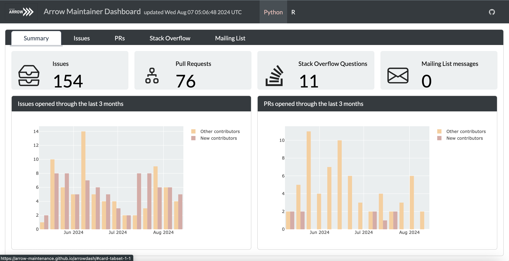
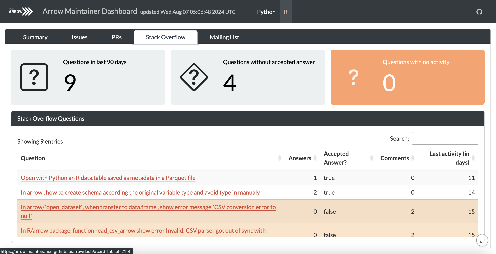
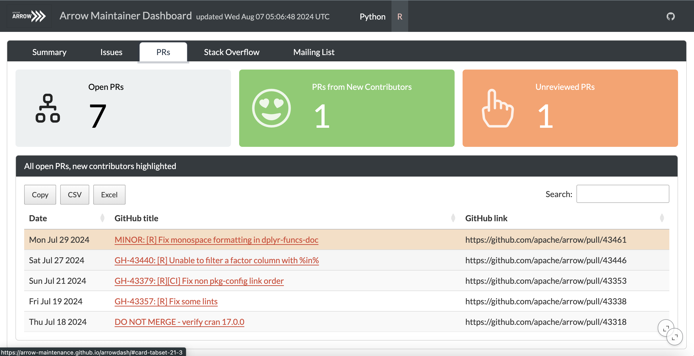

# Arrow Maintainer Dashboard

Quarto dashboard for simplifying project maintenance and monitoring
important metrics for tracking project sustainability.



 | 
:--------------------------------------------------------------:|:--------------------------------------------------------------:

## Setup for local development

For local development both Python and R need to be installed.
In an active R session first install `remotes` package:

```r
install.packages("remotes")
```

and from the project root directory (`/arrowdash`) install R
dependencies:

```r
remotes::install_deps()
```

then create Python virtual environment with ``reticulate``:

```r
library(reticulate)
virtualenv_create("r-arrow-dash")
virtualenv_install(requirements="requirements.txt", envname = "r-arrow-dash")
```

This will save the virtual environment named "r-arrow-dash" into the
`.virtualenvs` for Quarto dashboard to find.

Make sure you select the "r-arrow-dash" environment in your terminal with
`source your-path/.virtualenvs/r-arrow-dash/bin/activate`
and export the GitHub access token in the terminal with
`export GH_API_TOKEN=my_token` where `py_token` is your active GitHub token.